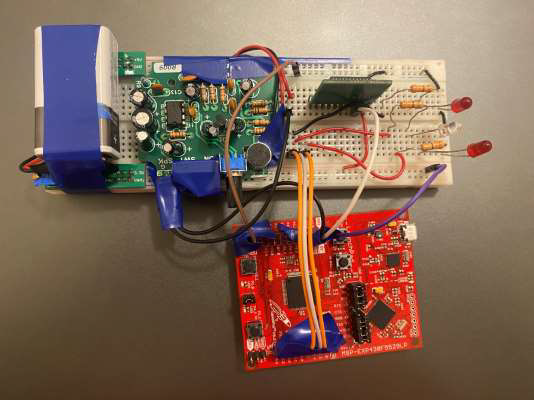

# **AudioMotion Illuminate**

## **Overview**
**AudioMotion Illuminate** is a two-part project that controls LEDs based on sound and motion. The project utilizes a MSP430 microprocessor with 12-bit Analog-to-Digital conversion to activate 3 separate LED lights: 2 red and 1 white. The first part of the project features a clap-controlled light switch, and the second part uses an acceleration sensor to activate the LEDs based on movement. 

The goal of this project is to showcase how simple sound and motion inputs can control LEDs in creative ways, providing a foundation for further development in aesthetic lighting systems and sports performance tracking.

---

## **Project Parts**

### **1. Clap-Controlled Light Switch**
This part of the project allows the user to control the LEDs by clapping hands or snapping fingers. The system has 5 different modes that can be cycled through by clapping or snapping:

- Each of the 3 LEDs turns on separately
- All 3 LEDs turn on together
- A Christmas light effect using all 3 LEDs

### **2. Acceleration-Activated LED Indicator**
The second part of the project uses an accelerometer to detect motion. The system measures acceleration for a 5-second period and turns on specific LEDs based on the following conditions:
- No acceleration detected: All LEDs blink.
- Acceleration below threshold: 2 red LEDs turn on.
- Acceleration above threshold: White LED turns on.

---

## **Motivation & Purpose**

The two different parts of this project serve unique purposes:
- **Clap-Controlled Light Switch:** The motivation behind this was to create an aesthetic LED lighting system that can be controlled by clapping. This can be extended to control LED strips and be used in settings like dorm rooms or home decor.
- **Acceleration-Activated LEDs:** This part was inspired by sports and fitness, where measuring maximum acceleration could be useful in evaluating athletic performance. The system could potentially be used to track an athlete’s acceleration in sports like basketball or football.

---

## **Key Features**
- 5 different modes for the clap-controlled LED light switch.
- Acceleration detection and response system using an accelerometer.
- Each part of the project can be used separately or integrated into one microprocessor program.
- Real-time acceleration detection for potential use in sports performance tracking.

---

## **Lessons Learned & Challenges**
- **Electronics & Hardware:** This project taught me how to work with datasheets of electromechanical devices like amplifiers and accelerometers, and how to use the microprocessor's 12-bit ADC for precise control over LEDs.
- **Troubleshooting:** The project provided significant insights into debugging hardware and software issues.
- **Combining Systems:** One of the key challenges was integrating both parts into a single program while keeping each part’s functionality intact.

---

## **Future Improvements**
- **Compact Design:** Replace the IC amplifier with a smaller, more compact amplifier that can be powered alongside other components to make the project more portable and easier to test.
- **3D Printed Housing:** Create a 3D printed case to house the wiring and electrical components, leaving only the LEDs exposed for easier use and storage.
- **RGB LED Strip:** Upgrade the 3 LEDs to an RGB light strip, which would enhance both the clap-controlled light switch and the acceleration-activated system, making it more functional and aesthetically pleasing for practical applications.

---

## **Acknowledgments**
This project was developed as a part of an 3rd year physics lab course, providing valuable experience in microprocessor programming, hardware design, and project integration.
